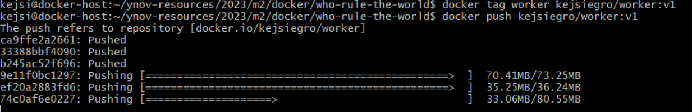

Nom d'édutiant : 

* DANG Ngoc Ha Lan
* Kejsi ERGO
* SORIANO Precious

# Projet "WhoRuleTheWorld" 

Le projet "Who Rule The World app? CATs or DOGs?" est une application distribuée simple fonctionnant sur plusieurs services. Pour le mettre en œuvre, il est recommandé de l'exécuter dans une machine virtuelle équipée de Docker et Docker Compose.

Le projet utilise Python, Node.js, .NET, Redis, et Postgres.

## Sommaire
- [Clone projet](#cloneprojet)
- [Création de private registry](#createprivateregistry)
- [Worker service](#workerservice)
- [Vote service](#voteservice)
- [Seed-data service](#seeddataservice)
- [Result service](#resultservice)
- [Construit l'image depuis DockerFile](#createimage)
- [Publication dans private registry](#privateregistry)
- [Publication dans Docker Hub](#dockerhub)
- [Création de Docker compose](#dockercompose)
- [Résultat](#resultat)

## Clone projet 

Dans le répository de la machine virtuelle, on fait la commande suivante pour clone le projet : 
`git clone https://github.com/HaLan0101/ynov-resources.git`

## Création de private registry

On crée un nouveau private registry pour stocker nos images : 

1. On crée un registry qui va exposer le port 5000 avec le nom registry 
`docker run -d -p 5000:5000 --restart always --name registry registry:2`

2. On crée un nouveau network qui s'appelle "registry-network" :
`docker network create registry-network`

3. On connecte le registry dans le network qu'on vient de créer :
`docker network connect registry-network registry`

4. On crée un frontend pour le registry qui va exposer le port 8000.
`docker run -d -e ENV_DOCKER_REGISTRY_HOST=registry -e ENV_DOCKER_REGISTRY_PORT=5000 --network registry-network -p 8000:80 konradkleine/docker-registry-frontend:v2`

5. On ajoute le port 8000 dans le réseau de la machine virtuelle : 

6. Le frontend de private registry qu'on peut accéder depuis notre machine phisique:

## Worker service

On crée le fichier Dockerfile dans le dossier "Worker" pour construire l'image

* Voici les commandes :
`nano Dockerfile`

* On le sauvegarde et voici le code dans ce fichier :

## Vote service

On crée le fichier Dockerfile dans le dossier "Vote" pour construire l'image

* Voici les commandes :
`nano Dockerfile`

* On le sauvegarde et voici le code dans ce fichier :

## Seed-data service

On crée le fichier Dockerfile dans le dossier "seed-date" pour construire l'image

* Voici les commandes :
`nano Dockerfile`

* On le sauvegarde et voici le code dans ce fichier :

## Result service

On crée le fichier Dockerfile dans le dossier "result" pour construire l'image

* Voici les commandes :
`nano Dockerfile`

* On le sauvegarde et voici le code dans ce fichier :

## Construit l'image depuis DockerFile

* On crée un docker compose pour lancer tous les fichiers Dockerfile que nous avons créés lors des étapes précédentes et pour ensuite créer les images.

* docker-compose-build.yaml:

## Publication dans private registry

* On publie chaque image qu'on vient de contruire dans notre private registry :
1. Push l'image worker :

`docker tag worker localhost:5000/worker`
`docker push localhost:5000/worker`

2. Push l'image vote :

`docker tag vote localhost:5000/vote`
`docker push localhost:5000/vote`

3. Push l'image seed-data :

`docker tag seed-data localhost:5000/seed-data`
`docker push localhost:5000/seed-data`

4. Push l'image result :

`docker tag result localhost:5000/result`
`docker push localhost:5000/result`

* On vérifie si tous les images soient publiés bien dans le private registry : 

`curl localhost:5000/v2/_catalog`

## Publication dans Docker Hub

* On se connecte à Docker Hub avec la commande suivante :

`docker login`

* Les images actuelles : 

* On publie chaque image qu'on vient de contruire dans Docker Hub :

1. Push l'image worker :

`docker tag worker kejsiegro/worker:v1`
`docker push kejsiegro/worker:v1`

2. Push l'image vote :

`docker tag vote kejsiegro/vote:v1`
`docker push kejsiegro/vote:v1`

3. Push l'image seed-data :

`docker tag seed-data kejsiegro/seed-data:v1`
`docker push kejsiegro/seed-data:v1`

4. Push l'image result :

`docker tag result kejsiegro/result:v1`
`docker push kejsiegro/result:v1`

* Voici les images dans Docker Hub :

* Voici les images dans docker : 

## Création de Docker compose

* On crée un docker compose.yml pour déployer les applications depuis les images de private registry

* On lance le docker compose avec la commande suivante:

`docker compose up -d`

## Résultat

